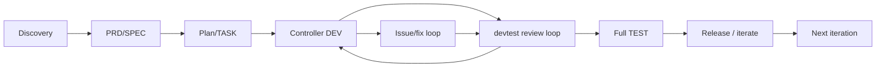

# dev-flow 工程管理深度审计

更新时间：2026-05-25 22:43
分支：`refactor`
文档根：`dev-doc/refactor`

本文件是当前分支 31 个任务的统一证据和设计产物。路径按分支规范放在
`dev-doc/refactor/research/`，而不是根 `dev-doc/research/`。

## 核心判断

dev-flow 的目标不是复制一个大型工程管理平台，而是让 agent 在轻量流程下先想清楚再做，并用少量硬约束阻止常见失控：无任务开发、文档与实际项目脱节、测试结果不可追溯、issue 无闭环、任务勾选造假。

本轮结论：

- 保留阶段文档、branch-specific dev-doc、hooks、mode 分层和 `/iterate`。
- 加强 `/check`、`/status`、task/SPEC/issue 模型和追踪 ID。
- 新增外部发现机制、cross-artifact analyze、artifact health gate、SPEC/TASK 自检、devtest controller。
- 剪掉或降级复杂 agent roster、GUI 专属能力、默认 TDD、重型企业测试和无必要的全量模板。

## 审计原则

| 原则 | 本轮判定标准 |
| --- | --- |
| 先想清楚再做 | 实现前必须有目标、边界、方案、验收；MVP 也不能蛮干。 |
| 轻量 | 默认路径不增加长模板；复杂能力必须模式化、可选化。 |
| 规范 | artifact 有稳定结构、ID、状态、引用关系。 |
| 约束 | 关键错误要能阻断，不能只提醒。 |
| 目标必要性 | 只吸收对工程管理目标必要的能力。 |
| 同步性 | dev-doc 必须与 branch、task、VERSION、测试、archive 同步。 |
| 模式适配 | full/quick/fast/mvp 的门槛不同，测试和 review 不一刀切。 |

## Evidence 格式

- Evidence：本仓库路径、外部仓库文件或官方文档 URL。
- Finding：发现的问题或可学习机制。
- Adopt/Reject：直接采用、降复杂度采用、不采用。
- Task Mapping：映射到 T1-T31。

## T1 外部候选池与筛选

| 候选 | 定位 | 为什么值得看 | 需要深入查看的内部文件/目录 | 适配点 | 不适配风险 | 优先级 |
| --- | --- | --- | --- | --- | --- | --- |
| Superpowers | agent skill 工作流包 | 强约束、设计先行、计划粒度、review 回环清晰 | `skills/brainstorming/SKILL.md`, `writing-plans`, `subagent-driven-development`, `systematic-debugging`, `test-driven-development`, `verification-before-completion`, review/finish skills | 先想清楚、验证纪律、subagent 隔离 | 默认 TDD 和强审批对 mvp/fast 可能过重 | P0 |
| GitHub Spec Kit | spec-driven development 模板和命令 | constitution 权威、feature directory、analyze、一致性检查完整 | `templates/commands/{constitution,specify,clarify,plan,tasks,analyze,implement}.md`, `templates/*-template.md`, scripts | cross-artifact analyze、任务格式、checklist gate | feature directory 和模板链偏重 | P0 |
| OpenSpec | 轻量变更提案和 delta spec | change folder、proposal/design/tasks/spec delta、archive 思路贴近 dev-flow | `docs/concepts.md`, `docs/commands.md`, `openspec/changes/*`, `schemas/*` | change proposal、delta、archive 后主 spec 演进 | 工作区 beta、流程过于自由时 gate 不足 | P0 |
| GSD / get-shit-done | 大型 AI 工程管理框架 | `.planning` 状态、phase roadmap、fresh context、wave 执行、drift gate | `docs/ARCHITECTURE.md`, `docs/CONFIGURATION.md`, `docs/INVENTORY.md`, `get-shit-done/workflows/*`, `agents/*`, `templates/*`, `bin/lib/*.cjs` | state machine、roadmap、context rot 防治、依赖 wave | agent 数量和配置面过大；原 repo 已迁移 | P0 |
| Kiro Desktop Specs | GUI spec/task 工程管理 | requirements/design/tasks 三件套、Quick Plan、任务依赖 waves、Steering、Hooks | 官方 `specs`, `feature-specs`, `quick-plan`, `best-practices`, `steering`, `hooks` docs；如本机可用再看桌面 UI | 三件套、bugfix spec、Sync Files、Run all Tasks 语义 | GUI 状态/UI 能力不能直接搬到 CLI 文档 | P0 |
| BMad Method | AI agile 方法和 workflow pack | planning tracks、fresh chat、story lifecycle、sprint-status、readiness check | `docs/tutorials/getting-started.md`, `docs/reference/workflow-map.md`, `docs/reference/testing.md`, `src/bmm/workflows/4-implementation/*` | next guidance、story 文件、readiness gate、测试分层 | 模块/agent/workflow 数量太多 | P0 |
| Task Master AI | AI 任务管理和 MCP/CLI | PRD parse、next task、dependencies、tags/workstreams、complexity | `README.md`, `docs/task-structure.md`, docs for dependencies/tags/research/loop/MCP | dependency-aware next-task、complexity、tag per branch | MCP tool 面大、token 成本高、外部模型/API 依赖 | P0 |
| OpenHands | 大型 agent 项目工程化 | 开发环境、issue triage、贡献流程、benchmark/evaluation | `Development.md`, `ISSUE_TRIAGE.md`, `CONTRIBUTING.md`, tests/CI/evaluation docs | severity、信息不足处理、环境检查、benchmark 思路 | 项目规模远大于 dev-flow，不适合照搬 CI/benchmark | P1 |
| Aider | CLI pair programming | Git-first、small change loop、明确 diff | README、docs、commands、tests | git 同步和可回滚 | 不是流程管理核心 | P2 |
| Continue | IDE agent/context 管理 | context provider、rules、model routing | docs/config、rules、context providers | context 加载分层 | IDE 绑定强 | P2 |
| Roo Code | agent mode/workflow | mode 分层、任务树、IDE 操作 | docs/custom modes、rules、workflows | 模式适配 | VS Code 绑定强 | P2 |
| OpenCode | terminal agent runtime | command/agent/rule 跨 runtime | docs/commands/agents | 多 runtime 兼容 | 不直接提供工程流程模型 | P2 |
| Spec-Kitty | spec/task prompt 模板类项目 | 轻量 SDD 思路补充 | repo templates/commands | 轻量模板 | 生态成熟度不稳定 | P2 |
| SDD Pilot | spec-driven workflow 衍生 | 对 Spec Kit/OpenSpec 的变体可反向验证 | repo docs/examples | 发现不同组织方式 | 可能只是薄包装 | P2 |

筛选规则：

1. 每次工程管理改造至少主动找 5 个候选，不等用户点名。
2. 至少深入 3 个候选的内部文件，不只看 README。
3. 每个采用建议必须回答七个问题：是否服务目标、是否帮助先想清楚、是否轻量、是否规范、是否形成约束、是否同步真实项目、是否适配模式。
4. 无法满足七问的能力只能进入 Reject 或降复杂度采用。

## T2 证据索引

| ID | Evidence | 用途 |
| --- | --- | --- |
| L-001 | `README.zh-CN.md`, `README.md` | 已写入“小而美、先想清楚、目标必要性、同步性、模式适配”理念。 |
| L-002 | `dev-doc/refactor/STATUS.yaml`, `dev-doc/refactor/SPEC.md`, `dev-doc/refactor/task/task_2026-05-25_1.md` | 当前分支 dev-doc 已与 branch 绑定。 |
| L-003 | `skills/dev-flow/SKILL.md` | 当前流程仍描述根 `dev-doc/`，未充分表达 branch-specific 约定。 |
| L-004 | `commands/*.md`, `scripts/commands/*.sh` | 命令文档与脚本实现的状态转换、gate、路径检测。 |
| L-005 | `scripts/hooks/*.sh`, `hooks.json` | hooks 阻断/提醒能力与误伤边界。 |
| L-006 | `tests/test_*.sh` | 测试体系，包含行为/E2E/篡改测试，也存在关键词测试。 |
| E-SUP-001 | https://raw.githubusercontent.com/obra/superpowers/main/skills/brainstorming/SKILL.md | 设计先行、用户批准、spec self-review。 |
| E-SUP-002 | https://raw.githubusercontent.com/obra/superpowers/main/skills/writing-plans/SKILL.md | exact file paths、2-5 分钟步骤、无 placeholder、期望输出。 |
| E-SUP-003 | https://raw.githubusercontent.com/obra/superpowers/main/skills/subagent-driven-development/SKILL.md | fresh subagent、两阶段 review、四状态 controller。 |
| E-SUP-004 | https://raw.githubusercontent.com/obra/superpowers/main/skills/systematic-debugging/SKILL.md | 根因先行、分阶段调试。 |
| E-SUP-005 | https://raw.githubusercontent.com/obra/superpowers/main/skills/test-driven-development/SKILL.md | TDD gate 与例外。 |
| E-SUP-006 | https://raw.githubusercontent.com/obra/superpowers/main/skills/verification-before-completion/SKILL.md | completion claim 必须有新鲜验证证据。 |
| E-SPEC-001 | https://raw.githubusercontent.com/github/spec-kit/main/templates/commands/specify.md | feature directory、spec quality checklist。 |
| E-SPEC-002 | https://raw.githubusercontent.com/github/spec-kit/main/templates/commands/tasks.md | task ID、story label、file path、parallel marker、dependency graph。 |
| E-SPEC-003 | https://raw.githubusercontent.com/github/spec-kit/main/templates/commands/analyze.md | read-only cross-artifact consistency analysis。 |
| E-SPEC-004 | https://raw.githubusercontent.com/github/spec-kit/main/templates/commands/constitution.md | constitution 权威与模板传播。 |
| E-OPEN-001 | https://raw.githubusercontent.com/Fission-AI/OpenSpec/main/docs/concepts.md | change folder、delta spec、archive、progressive rigor。 |
| E-OPEN-002 | https://raw.githubusercontent.com/Fission-AI/OpenSpec/main/docs/commands.md | `/opsx:propose/explore/apply/sync/archive` 流程。 |
| E-GSD-001 | https://raw.githubusercontent.com/gsd-build/get-shit-done/main/docs/ARCHITECTURE.md | `.planning` state、fresh context、wave execution、drift gate。 |
| E-GSD-002 | https://raw.githubusercontent.com/gsd-build/get-shit-done/main/docs/CONFIGURATION.md | workflow toggles、model profiles、guard 配置。 |
| E-GSD-003 | https://github.com/open-gsd/get-shit-done-redux | 旧 GSD repo 已迁移，新维护方需要单独评估。 |
| E-KIRO-001 | https://kiro.dev/docs/specs/ | requirements/design/tasks、bugfix spec、parallel waves。 |
| E-KIRO-002 | https://kiro.dev/docs/specs/quick-plan/ | Quick Plan：先澄清，单次生成三件套。 |
| E-KIRO-003 | https://kiro.dev/docs/steering/ | `.kiro/steering`、inclusion modes、file references。 |
| E-KIRO-004 | https://kiro.dev/docs/hooks/ | IDE events hooks。 |
| E-BMAD-001 | https://raw.githubusercontent.com/bmad-code-org/BMAD-METHOD/main/docs/tutorials/getting-started.md | tracks、fresh chats、build cycle。 |
| E-BMAD-002 | https://raw.githubusercontent.com/bmad-code-org/BMAD-METHOD/main/docs/reference/workflow-map.md | phase map、story lifecycle、sprint-status。 |
| E-BMAD-003 | https://raw.githubusercontent.com/bmad-code-org/BMAD-METHOD/main/docs/reference/testing.md | Quinn vs TEA 测试分层。 |
| E-BMAD-004 | https://raw.githubusercontent.com/bmad-code-org/BMAD-METHOD/main/src/bmm/workflows/4-implementation/create-story/template.md | story 模板：AC、tasks、dev notes、file list。 |
| E-TM-001 | https://raw.githubusercontent.com/eyaltoledano/claude-task-master/main/README.md | parse-prd、next、research、tool loading core/standard/all。 |
| E-TM-002 | https://raw.githubusercontent.com/eyaltoledano/claude-task-master/main/docs/task-structure.md | tagged tasks、dependencies、status、testStrategy。 |
| E-OH-001 | https://raw.githubusercontent.com/OpenHands/OpenHands/main/Development.md | 环境、运行、测试、文档入口。 |
| E-OH-002 | https://raw.githubusercontent.com/OpenHands/OpenHands/main/ISSUE_TRIAGE.md | severity、not enough info、stale、拆 issue。 |
| E-OH-003 | https://raw.githubusercontent.com/OpenHands/OpenHands/main/CONTRIBUTING.md | PR、CI、agent 变更评估维度。 |

## T3 Superpowers 审计

直接可学：

- Brainstorming 强制先检查上下文、提问、方案比较、写 spec、自检、用户确认后再计划。dev-flow 已有 `/brainstorm`，但需要把“设计文档审批前禁止实现”升级为可检查的状态字段，而不是只靠文档(但可以利用./tmp/写demo手脑并用快速brainstorming)。
- Writing plans 要求每个任务有 exact file paths、测试命令、期望失败/通过输出、无 placeholder。dev-flow 当前 task 只有 details/Done when，执行性不足。
- Subagent-driven development 的 fresh subagent、spec compliance review、code quality review、DONE/DONE_WITH_CONCERNS/NEEDS_CONTEXT/BLOCKED 四状态，已经被 dev-flow `/devtest` 吸收了一部分，但目前多在 markdown，缺脚本化 controller。
- Verification before completion 的“证据先于完成声明”应纳入task规范：完成 task 必须记录 verification evidence。

需改造后学：

- TDD：MVP/fast 只要求基本行为验证和 smoke test，不能要求“无失败测试先行就删代码重写”。
不适合学：

- 对所有小变更都强制用户审批多轮设计，违反 dev-flow 的轻量原则。
- 每个任务都强制 commit，对未启用 git 或快速验证项目过重。

dev-flow 已优于它：

- dev-flow 已有 `/iterate`、VERSION、archive、branch-specific doc-root 的迭代同步方向，Superpowers 更偏开发技能，不负责项目文档状态机。

反向批判：

- Superpowers 的 TDD iron law 对快速原型过重。
- skill 组合多，agent 若频繁读取会带来上下文成本。

Task Mapping：T3, T19, T20, T25, T26, T27, T29。

## T4 GitHub Spec Kit 审计

直接可学：

- `constitution.md` 把原则作为非协商权威，并要求同步模板。dev-flow 应将核心原则放入 `SPEC.md` 的 “Principles” 并纳入 `/check`。
- `specify.md` 创建 feature directory、限制 clarifications、生成 quality checklist。dev-flow 可采用 checklist，但不要强制每个 feature 目录。
- `tasks.md` 的 task 格式有 ID、parallel marker、file path、dependency graph、independent test criteria。dev-flow task 模板应吸收这些字段。

需改造后学：

- constitution 不单独做大文档，先作为 `SPEC.md` 和 `/check` 的核心规则，后续再抽离。

不适合学：

- Spec Kit 的 template 链较重，dev-flow 不应在 mvp/fast 模式创建完整 research/data-model/contracts。
- checklist 如果只是生成但不阻断，会变成表面合规。

dev-flow 已优于它：

- dev-flow 的 mode 分层更明确，能让 quick/fast/mvp 使用不同门槛。

反向批判：

- Spec Kit 易产生多文件模板负担，小项目会被 feature directory 和 checklist 压垮。
- Cross-artifact analyze 默认只输出报告不改文件，dev-flow 需要进一步把 P0 变成阻断。

Task Mapping：T4, T13, T19, T20, T23, T24, T25, T26。

## T5 OpenSpec 审计

直接可学：

- delta specs 用 ADDED/MODIFIED/REMOVED 表达变更，比整篇 SPEC 重写更适合 brownfield。
- archive 时将 delta merge 到主 specs，并保留完整上下文，正好对应 dev-flow `/iterate` 的同步性。
- progressive rigor：默认 Lite，风险高再 Full，贴合 dev-flow 的 mode 适配。

需改造后学：

- delta spec 可成为 SPEC 的可选章节：`## Change Delta`，quick/full 必填，mvp 可简写。

不适合学：

- OpenSpec “dependencies are enablers, not gates” 很灵活，但 dev-flow 需要某些硬门禁。
- OpenSpec workspace support 文档标注仍在 beta，不应复制跨 repo workspace 自动化。

dev-flow 已优于它：

- dev-flow 已有 hooks 和状态注入，能在 agent 行为层约束，不只是组织文档。

反向批判：

- 太流动时可能允许 agent 绕过“先想清楚再做”。
- Delta merge/archive 如果没有脚本验证，容易让主 spec 和实现再次漂移。

Task Mapping：T5, T20, T22, T23, T30, T31。

## T6 GSD / get-shit-done 审计

已确认：`gsd-build/get-shit-done` README 显示该仓库不再是活跃开发主仓，指向 `open-gsd/get-shit-done-redux`。本轮仍审计旧仓架构文档，因为 T6 指定了该仓，后续实现前应再评估 open-gsd 新仓。

直接可学：

- `.planning/PROJECT.md`, `REQUIREMENTS.md`, `ROADMAP.md`, `STATE.md`, `phases/` 形成持久状态。dev-flow 已有 `dev-doc/`，但缺 `STATE` 级别的事实字段和健康状态。
- Fresh context per agent + thin orchestrator：dev-flow 的独立 agent 原则一致，但需要明确 controller 只调度、不塞过多上下文。
- plan checker、verifier、requirements coverage gate、decision coverage gate 对应 dev-flow `/check` 与 `/devtest` 的目标形态。
- wave execution 与 STATE lock 提醒 dev-flow 并发前必须先有 task dependency graph 和写入互斥。
- drift gate 能发现代码结构变化后文档未映射，dev-flow `/check` 应吸收轻量版。

需改造后学：

- `.planning/STATE.md` 不另起目录，映射为 `dev-doc/<branch>/STATUS.yaml` + `artifact-index.yaml`。
- agent roster 不复制，只保留最小角色：prd/spec/task/devtest/test/fix。
- model profile 可以保留为 task 的 `model` 字段，但不引入大型 profile 表。

不适合学：

- 31+ agents、86+ skills、MCP/namespace routing 对 dev-flow 过重。
- 自动 parallel commits、cross-runtime SDK bridge 超出当前目标。

dev-flow 已优于它：

- dev-flow 当前结构更小，用户可直接读懂；更符合“小而美”。

反向批判：

- GSD 的配置面和 agent 数量会显著提高理解成本。
- 主仓迁移暴露供应链/维护风险，吸收前必须验证当前可信源。

Task Mapping：T6, T13, T22, T23, T27, T28, T30。

## T7 Kiro Desktop 审计

直接可学：

- Kiro Specs 的核心三件套是 `requirements.md` 或 `bugfix.md`、`design.md`、`tasks.md`。dev-flow 已有 PRD/SPEC/TASK，但 bugfix spec 还弱。
- Task UI 实时更新状态，并在 Run all Tasks 时构建依赖图、按 waves 并发执行。dev-flow 可先设计 waves，不急着实现并发。
- Quick Plan 先集中问 clarifying questions，然后一次生成 requirements/design/tasks，适合 dev-flow quick/fast 的轻量路径。
- Steering 文件提供 workspace/global/team 作用域、fileMatch/manual/auto inclusion 和 file references。dev-flow 的 AGENTS/skill 需要增加轻量 steering 规则，但避免复制 GUI。
- Sync Files 能让 tasks 与实际代码同步，正对应用户说的“文档必须和实际项目同步”。

需改造后学：

- Kiro GUI 的 spec panel/status UI 迁移为 `/status` 输出和 `artifact-index.yaml`。
- Bugfix Specs 转换为 issue 模板升级：repro/current/expected/unchanged behavior/regression tests。

不适合学：

- GUI 专属 “Run all Tasks” 一键并发不能直接复制到 CLI，必须先有 dependency graph、review gate、失败暂停。
- Kiro 的 Quick Plan 不适合复杂/合规场景默认使用。

dev-flow 已优于它：

- dev-flow 可跨 Codex/Claude，不绑定桌面 GUI。

反向批判：

- GUI 状态可能让用户以为状态准确，但如果没有脚本检查仍会漂移。
- Quick Plan 跳过阶段审批，若无 Analyze Requirements 会产生低质量需求。

Task Mapping：T7, T19, T20, T22, T26, T28。

## T8 BMad Method 审计

直接可学：

- `bmad-help` 会检查项目已完成内容并推荐下一步。dev-flow `/status` 应从静态 phase mapping 升级为事实驱动下一步。
- 三条规划轨道：Quick Flow、BMad Method、Enterprise。dev-flow 的 fast/quick/full/mvp 应补充每种模式的必需 gate。
- story lifecycle：sprint planning → create story → dev story → code review → retrospective。dev-flow task 可吸收 story 文件的 AC、dev notes、file list。
- Testing options 用 Quinn vs TEA 分层：先快速覆盖，复杂项目再引入 traceability/quality gate。

需改造后学：

- `sprint-status.yaml` 不另立系统，映射到 `STATUS.yaml` 与 task 状态。
- retrospective 可作为 `/iterate` 的可选章节，不默认拉长流程。

不适合学：

- 12+ agents、34+ workflows 对 dev-flow 过重。
- Party mode、模块生态不是当前目标必要能力。

dev-flow 已优于它：

- dev-flow 的 docs 目录结构更直接，初学成本低。

反向批判：

- BMad 的术语和 workflow 数量容易让用户先学工具而不是推进项目。
- fresh chat 强约束在 Codex thread 里未必自然，需要转化为 fresh subagent/context isolation。

Task Mapping：T8, T13, T21, T22, T25, T29, T31。

## T9 Task Master AI 审计

直接可学：

- task JSON 有 `status`, `dependencies`, `priority`, `details`, `testStrategy`, `subtasks`，比 dev-flow 当前 markdown task 更可计算。
- `next` 会找依赖满足且待处理的任务，并按优先级选择。dev-flow `/status` 和 `/devtest --continuous` 应吸收 next-task 计算。
- `analyze-complexity` 和 `complexity-report` 可帮助拆任务，但 dev-flow 应轻量化为 `complexity: S/M/L`。
- tags/workstreams 支持分支/上下文隔离，能解释为什么 `dev-doc/<branch>` 是必要的。
- tool loading core/standard/all 是一个好反例：能力分层能降低上下文成本。

需改造后学：

- 不引入 JSON-only task store，先在 markdown frontmatter/字段中支持稳定 ID 和可解析字段。

不适合学：

- MCP all tools 默认上下文成本高，不符合轻量。
- API key/research model 依赖不应成为 dev-flow 基础能力。

dev-flow 已优于它：

- dev-flow 不只是任务管理，还覆盖 PRD/SPEC/TEST/iterate 全生命周期。

反向批判：

- AI 生成 task 若没有 SPEC 契约和 `/check`，会产生执行性很强但目标错的任务。
- tags 如果不绑定 git branch 和 archive，会成为另一套漂移状态。

Task Mapping：T9, T19, T23, T24, T26, T28。

## T10 OpenHands 审计

直接可学：

- `Development.md` 给出明确环境、构建、运行、测试入口。dev-flow `/check` 应检查项目标准验证入口是否被记录。
- `ISSUE_TRIAGE.md` 有 type 标签、severity、not enough info、拆分多请求、stale 规则。dev-flow issue 模板应吸收 severity/repro/info-needed/close condition。
- `CONTRIBUTING.md` 对 core agent changes 用 accuracy/efficiency/code quality 评估，适合 dev-flow 自身改造评估。
- benchmark/evaluation 思路可转成 dev-flow 的 workflow regression tests，而不是复制大型 benchmark。

需改造后学：

- OpenHands 的大型开发环境检查只做轻量版本：标准 test/build 命令、依赖是否可运行、docs 是否指向正确入口。

不适合学：

- 大型项目 CI 和 benchmark 成本不适合 dev-flow 每轮默认执行。
- 社区贡献流程不应混入普通用户项目的 dev-doc。

dev-flow 已优于它：

- dev-flow 对个人/小项目更轻；OpenHands 更偏大型开源协作。

反向批判：

- issue stale 自动关闭可能丢失真实问题，dev-flow 不应默认自动关闭用户项目 issue。
- 环境文档详细但不能保证 agent 会执行，仍需要 gate。

Task Mapping：T10, T21, T24, T29。

## T11 外部发现机制

[不需要，已经删除]

## T12 外部项目反向批判总表

| 项目 | 不应照搬 1 | 不应照搬 2 | dev-flow 避免方式 |
| --- | --- | --- | --- |
| Superpowers | 默认 TDD 对 mvp/fast 过重 | 多 skill 串联上下文成本高 | TDD mode-gated；只保留必要 gate |
| Spec Kit | feature directory/checklist 链过重 | analyze 只读不阻断 | branch doc-root；P0 规则写入 `/check` |
| OpenSpec | 过于 fluid 时 gate 不足 | workspace beta 不稳定 | proposal/delta 轻量吸收；不做 workspace 自动化 |
| GSD | agent roster 和配置面过大 | 旧 repo 迁移带维护风险 | 只学 STATE/waves/drift；验证新来源再实现 |
| Kiro | GUI 状态不能直接迁移 | Quick Plan 可能跳过必要审批 | 转成 CLI `/status`/`/check`；复杂模式保留 gate |
| BMad | workflow/agent 术语太多 | fresh chat 依赖工具使用习惯 | 映射为 mode 和 subagent 隔离；不复制生态 |
| Task Master | MCP 工具面/token 成本高 | task store 可与 spec 脱节 | markdown 可解析字段；task 必须引用 SPEC/REQ |
| OpenHands | 大型 CI/benchmark 过重 | stale 自动关闭不适合个人项目 | 只学 triage 和 eval 思路；不自动关闭 |

## T13 dev-flow 工程管理评估框架

评分：0 缺失，1 有文档，2 有脚本或测试，3 可阻断且可追溯。

| 维度 | 最低合格 | 优秀标准 | 当前分 | 主要证据 | 改进方向 |
| --- | --- | --- | --- | --- | --- |
| 目标必要性 | README/SPEC 写明原则 | 每个新增能力有 Adopt/Reject 记录 | 1 | L-001 | 本文件 decision register 变成模板 |
| 需求质量 | PRD/SPEC 有目标/非目标 | 有 ambiguity checklist 和自检 | 1 | `commands/spec.md` | SPEC self-check + `/check` |
| 范围控制 | mode 区分流程 | mode 影响 gate 和 task 必填字段 | 1 | `commands/mode.md` | mode-aware gate matrix |
| SPEC 契约 | SPEC 存在 | AC/NFR/edge/rollback/trace ID 完整 | 1 | `dev-doc/refactor/SPEC.md` | 新模板 |
| 任务可执行性 | task 有 Done when | file paths/test/expected/deps/parallel/model | 1 | task 文件 | 新 task 模板 |
| 追踪矩阵 | 文档互相引用 | PRD-FR/SPEC-AC/TASK/TEST/ISSUE 全链 | 0 | 缺失 | artifact ID |
| 项目同步性 | STATUS 时间更新 | branch/doc/VERSION/test/archive 一致性 gate | 1 | `status.sh`, `check.sh` | health gate |
| 状态机 | phase 字段 | 非法转换阻断，失败行为明确 | 1 | commands | state transition table |
| review 回环 | devtest markdown | controller 解析状态、写 issue、取消勾选 | 1 | `commands/devtest.md` | script controller |
| 测试策略 | test scripts | 行为正负例覆盖核心 gate | 2 | tests | 减少关键词测试 |
| 风险/ADR | 零散风险 | ADR/decision 轻量模板 | 0 | 缺失 | SPEC Decision section |
| CI/发布/回滚 | iterate | release/rollback/test/tag 一致性检查 | 1 | `iterate.sh` | release checklist |
| issue triage | issue 模板 | severity/repro/info-needed/close condition | 1 | `commands/issue.md` | issue v2 |
| 用户导航 | `/status` 下一步 | 根据事实推荐下一步 | 1 | `status.sh` | health-derived next |
| 上下文管理 | agent 隔离 | minimal input + artifact index + branch root | 2 | commands | 加 artifact-index |
| 模式分层 | full/quick/fast/mvp | 每模式必填字段和 gate 可计算 | 1 | `mode.md` | mode matrix |
| 可维护性 | bash 脚本可读 | shared doc-root/gate lib，减少重复 | 1 | scripts | 抽 `docroot.sh`/`health.sh` |

当前综合：18/51。不是失败，但已到必须强化门禁和追踪的阶段。

## T14 当前 dev-doc artifact 一致性审计

| 问题 | 位置 | 复现命令 | 影响 | 修复建议 |
| --- | --- | --- | --- | --- |
| 根 `dev-doc/` 与 branch `dev-doc/refactor/` 并存，skill 文档仍默认根目录 | `skills/dev-flow/SKILL.md`, `dev-doc/*`, `dev-doc/refactor/*` | `bash scripts/commands/status.sh` | 新 agent 可能写错 doc root | 所有命令/agent prompt 明确 `DOC_ROOT=dev-doc/<branch>` 优先 |
| refactor SPEC 验收契约仍写 TASK 阶段 0/31，但实际已进入 DEV | `dev-doc/refactor/SPEC.md` | `sed -n '1,120p' dev-doc/refactor/SPEC.md` | SPEC 与事实漂移 | 更新 acceptance contract 为当前 DEV 和完成进度 |
| root task 仍可能被旧脚本/人误认为当前任务 | `dev-doc/task/task_2026-05-24_*.md` | `find dev-doc/task -name 'task_*.md' -print` | 历史任务污染统计 | `/check` 输出 active doc-root，并警告根/branch 双活 |
| `TEST.md` 与当前 refactor 任务无关 | `dev-doc/TEST.md`, `dev-doc/refactor/` 缺 TEST | `find dev-doc/refactor -maxdepth 1 -name TEST.md -print` | test 证据断链 | 完成全量测试后写 `dev-doc/refactor/TEST.md` |
| CHANGELOG 只存自然语言，无 artifact ID | `dev-doc/refactor/CHANGELOG.md` | `sed -n '1,40p' dev-doc/refactor/CHANGELOG.md` | 不能追踪到 task/finding | changelog 条目增加 `TASK-T###` 可选引用 |
| task `nums` 只靠人工，不校验实际条目 | `scripts/init/validate.sh` | `rg -n "task nums|nums_mismatch" scripts/init/validate.sh tests` | 可伪造进度 | validate/check 校验 task nums |
| archive 命名与 branch doc-root 未完全统一 | `scripts/commands/iterate.sh` | `sed -n '1,160p' scripts/commands/iterate.sh` | 分支迭代归档路径易混淆 | artifact-index 记录 active/archive root |

## T15 dev-flow 自身理念符合度

| 结论 | 类型 | 本仓库证据 | 判断 | 改进 |
| --- | --- | --- | --- | --- |
| `/brainstorm` 明确实现前设计 gate | keep | `commands/brainstorm.md` | 符合先想清楚 | 加状态字段 `design_reviewed` |
| `/mode` 有 full/quick/fast/mvp | keep | `commands/mode.md` | 符合模式适配 | 补每模式必填 gate |
| branch doc-root 已被脚本部分支持 | improve | `status.sh`, `check.sh`, `inject-context.sh` | 符合同步性但未全覆盖 | 抽公共 doc-root resolver |
| task 模板缺 file path/test/expected | improve | `commands/task.md` | 违反可执行性 | 新 task v2 模板 |
| SPEC 完成检查靠关键词 | improve | `post-write.sh` | 规范弱约束 | `/check` 做结构和可测性检查 |
| hooks 有些提醒不阻断 | improve | `post-write.sh` | 约束不够强 | P0 health error exit non-zero |
| `/check` 只 warnings，无 severity | improve | `check.sh` | 不能作为门禁 | ERROR/WARN/OK |
| `/status` next 静态按 phase | improve | `status.sh` | 不够事实驱动 | 基于 health/issue/task deps |
| artifact ID 缺失 | add | 全局缺失 | 追踪断链 | PRD-FR/SPEC-AC/TASK/TEST/ISSUE |
| done_task 自动重命名 | keep/improve | `post-write.sh` | 轻量好用，但可掩盖批量造假 | 保留，增加 verification evidence |
| mvp 跳过 task/test/check | prune/improve | `commands/mode.md` | 快但易蛮干 | mvp 也要最小 spec + smoke evidence |
| `/done` 命令仍存在于 README 结构旧描述 | prune | `commands/done.md`, README 项目结构 | 概念过期 | 合并到 `/iterate` 并标 deprecated |

## T16 命令流程与状态转换

| 命令 | 前置 | 输出 | 状态变化 | 当前问题 | 目标 gate |
| --- | --- | --- | --- | --- | --- |
| `/brainstorm` | 无 | BRAINSTORM.md | 不一定改 phase | 有硬 gate 文档，脚本不可验证 | 写 `design_reviewed` 或 `brainstorm.status` |
| `/prd` | full 或需要正式需求 | PRD.md | PRD | prompt 禁读代码，合理；doc-root 逻辑重复 | 使用公共 doc-root |
| `/spec` | full 需 PRD；quick/mvp 可降级 | SPEC.md | SPEC | SPEC 自检弱 | 必填 AC/NFR/edge/rollback 按 mode |
| `/task` | full/quick 需 SPEC；fast 可用户描述 | task file | TASK | task 字段少 | task v2 + nums 校验 |
| `/devtest` | DEV + 已勾选任务 | issue/tests/状态 | DEV | controller 多在 markdown | 脚本化状态解析 |
| `/fix` | DEV + open issue | closed issue/代码 | DEV | issue triage 字段不足 | root-cause + regression evidence |
| `/test` | 全 task 完成 | TEST.md/issues | TEST 或 DEV | 全量测试 agent 未脚本化 | test report schema |
| `/check` | 任意 | health report | 不变 | 无 ERROR/WARN 级别 | 可作为 iterate 前 gate |
| `/status` | 任意 | status report | 不变 | next 过静态 | health-derived next task |
| `/iterate` | tasks done, no P0, valid VERSION | archive/tag/version | 新 phase | 只检查 P0 issue，不检查 WARN/P1 策略 | mode-aware release gate |
| `/mode` | 任意 | STATUS mode | phase 可能变 | mvp 文档与脚本描述不一致 | mode transition validation |
| `/issue` | 任意/DEV | issue file | 不变 | 字段弱 | issue v2 schema |

非法转换：

- SPEC 缺失却进入 TASK：full/quick 应 ERROR。
- task 未完成进入 TEST：`/test` 已文档阻断，需脚本化。
- open P0 issue 执行 iterate：`iterate.sh` 已阻断。
- branch 存在但写根 `dev-doc/`：需 ERROR。
- task 勾选但无 verification evidence：当前未阻断，需新增。

## T17 hooks 阻断能力与误伤

| Hook | 职责 | 当前行为 | 漏洞 | 误伤风险 | 测试用例 |
| --- | --- | --- | --- | --- | --- |
| `inject-context.sh` | 注入 phase/task/issue/status | 支持 branch doc-root，显示 P0 task/issue | 只输出 `[BLOCKED]`，不实际阻断后续工具 | 输出过多或 grep 解析失败 | branch doc-root、无 task DEV、open issue |
| `block-system-tmp.sh` | 禁用系统临时目录写入 | 检查 Bash command 和 Write/Edit path | 只匹配特定路径字符串，复杂 shell 可绕过 | 可能拦截只读命令里的路径文本 | Bash 写系统临时目录阻断，只读文本不阻断 |
| `block-non-dev-edit.sh` | 非 DEV 禁止改源码 | 只看根 `dev-doc/STATUS.yaml` | branch doc-root 下 phase=DEV 时可能误判 root phase | 文档或 tests 白名单过宽 | branch phase 测试；源码 edit 阻断 |
| `post-write.sh` | 更新时间、task 完成、doc sync、phase check | 多功能聚合，能提示 /devtest 和重命名 done_ | 提醒多于阻断；关键词完成标准弱；自动 mv 可能掩盖事实 | 自动 rename 对用户意外 | task deps violation、batch done、SPEC keyword |
| `save-changelog.sh` | Stop 时追加记录 | branch doc-root 支持 | topic 来自 git log，和真实 session 任务弱相关 | changelog 自动噪音 | branch changelog 写入、去重 |
| `hooks.json` | 注册 hooks | Codex hook 配置完整 | Claude/Codex 双入口可能漂移 | 无 | schema/关键 hook 存在性 |

改进优先级：

1. P0：公共 doc-root resolver，所有 hook 一致。
2. P0：`post-write` 对 task 勾选增加 verification evidence 检查，至少 WARN，full/quick 可 ERROR。
3. P1：`block-non-dev-edit` branch-aware。
4. P1：hook 输出包含修复命令和对应文档路径。

## T18 测试体系有效性

| 测试 | 类型 | 覆盖目标 | 风险盲区 | 升级 |
| --- | --- | --- | --- | --- |
| `test_context_integration.sh` | 行为 + 关键词 | context 输出、commands 引用 | 部分 grep 存在性 | 加 doc-root branch case |
| `test_commands.sh` | 关键词/基础行为 | command 文档与脚本 | 难证明真实状态机 | 转为 fixtures + expected output |
| `test_iterate.sh` | 行为 | iterate 归档/version/tag | 依赖 git 环境，P1/P2 策略弱 | 增加 branch doc-root |
| `test_inject_context.sh` | 行为 | 状态注入 | grep 解析边界 | 加 malformed yaml |
| `test_hooks_init.sh` | 存在性 | hook 注册 | 不测阻断真实 exit | 增加 PreToolUse input fixtures |
| `test_e2e_lifecycle.sh` | E2E | 生命周期 | 仍可模拟不足 | 保留 |
| `test_e2e_tampering.sh` | 负例/对抗 | 删除 issue、伪造 task、清空 changelog | 记录了多个已知限制未修 | 转成 P0 regression backlog |
| `test_e2e_adversarial.sh` | 对抗 | 绕过流程 | 需确认覆盖范围 | 作为 health gate 核心 |
| `test_v2_2_four_enhancements.sh` | 混合 | devtest/status/continuous | 很多文档关键词断言 | 将 controller 行为脚本化后替换 |
| `test_validate.sh` | 行为 | init validate | 不检查 task nums | 补 task nums mismatch |
| `test_migration.sh` / `test_migrate.sh` | 行为 | 迁移 | 未覆盖新 ID 模型 | 加 legacy doc migration |
| `test_all.sh` | suite | 总入口 | 若单测用关键词会假阳性 | 保留但分层输出 |

核心问题：测试很多，但不少是“文档里有某词”而非“流程真实阻断”。下一轮应把 `/check`、`/status`、controller、hook 用 fixture 做正负例。

## T19 新 task 模型

当前不足：

- 无稳定 task ID，`T1` 只在单文件内有效。
- 无 file paths/test files/expected output。
- 依赖是自然语言，难计算。
- 无 requirement/story/spec AC 追踪。
- 无 verification evidence。
- 无 parallel/wave/complexity。

新模板：
(dev doc相关doc在refs已经指出了,就不应该出现在docs里面)
(  - model: cheap|standard|capable就不需要了，复杂度已经暗示了用什么模型比较合适了)
(tasks 本身就算执行步骤框架，没有必要再做step的硬约束)
(不需要verification了，应该files里面有相关的test，实际情况应该是进入devtest自动触发相关test，test本身会说明是否失败以及更具体的信息)
(expected_output应当属于done when的一部分)
```markdown
- [ ] TASK-T001: <标题>
  - priority: P0|P1|P2
  - refs: PRD-FR-001, SPEC-AC-001
  - files:
      create: []
      modify: ["path/to/file:line"]
      test: ["tests/test_x.sh"]
      docs:["related/docs_name.md"]
  - depends_on: []
  - parallel: true|false
  - complexity: S|M|L
  - done_when:
      - <可测验收>
```

字段来源：

- file/test/expected：Superpowers writing-plans、Spec Kit tasks。
- deps/parallel/wave：Kiro、GSD、Task Master。
- refs/trace：Spec Kit analyze、BMad story AC。
- verification：Superpowers verification-before-completion。

## T20 新 SPEC 模型

当前 SPEC 缺口：

- 缺 stable acceptance IDs。
- 缺 edge cases/NFR/rollback/ADR/data state transitions。
- 缺 change delta。
- 缺 self-check。
- 验收契约写了当时状态，容易漂移。

新 SPEC 结构：

(不需要单独的change delta，有change直接写入notes，正好给notes加上实际作用)
```markdown
# SPEC: <change>

## Principles
<轻量、规范、约束、同步、模式>

## Scope
### In
### Out
### Mode Contract

## Requirements Trace
| PRD-FR | SPEC-AC | Notes |
<Change Delta in notes: ADDED, MODIFIED, REMOVED>

## Architecture
## Data / State Transitions
## Interface Contracts
## Acceptance Contract
- SPEC-AC-001: <可测行为>

## Edge Cases
## NFR
## Risks and Rollback
## ADR
## Verification Plan
## Self Check
```

必填：

- full/quick：Scope、Change Delta、Acceptance Contract、Verification Plan、Self Check。
- fast：Scope、Acceptance Contract、Verification Plan。
- mvp：Goal、Out of scope、Smoke Verification。

可选：

- Data model、interface contracts、ADR、NFR、rollback，在涉及 API/数据/安全/发布时必填。

## T21 issue 与缺陷闭环

升级 issue 模板：

```markdown
- [ ] ISSUE-I001: <标题>
  - source: devtest|test|fix|manual
  - severity: P0|P1|P2
  - type: bug|regression|spec-gap|test-gap|doc-drift|needs-info
  - status: open|in-progress|needs-context|fixed|wontfix
  - refs: TASK-T001, SPEC-AC-001, TEST-TC-001
  - location: path:line
  - current_behavior:
  - expected_behavior:
  - unchanged_behavior:
  - reproduce:
  - root_cause:
  - fix_plan:
  - verification:
  - close_condition:
```

闭环规则：

- `/devtest` FAIL：取消 task 勾选，写 P0/P1 issue，记录复测命令。
- DONE_WITH_CONCERNS：task 可完成，但写 P2 issue，`/iterate` 可按 mode 决定是否阻断。
- NEEDS_CONTEXT：不算失败，不推进，issue status 为 `needs-context`。
- `/fix` 必须先填 root cause，再改代码；修复后写 verification。
- `/test` 发现回归：必须映射到 SPEC-AC 或标为 spec-gap。

## T22 目标流程蓝图



Mode 路径：

| Mode | 路径 | 必要约束 | 可选增强 |
| --- | --- | --- | --- |
| full | brainstorm → prd → spec → task → dev → devtest → test → iterate | PRD/SPEC/TASK/TEST 全追踪，P0/P1 全阻断 | ADR、NFR、trace matrix |
| quick | spec → task → dev → devtest → test → iterate | SPEC AC、task file/test、health gate | PRD 可选 |
| fast | task → dev → smoke/test → iterate | task refs 可弱化，但要有 Done when 和 verification | SPEC delta 可补 |
| mvp | brainstorm/spec-lite → dev → smoke evidence → iterate | 目标/边界/验收清楚，不能无文档开干 | 后续切 quick/full 补 trace |

状态机：

| From | Trigger | Preconditions | Outputs | Failure |
| --- | --- | --- | --- | --- |
| NEW | `/mode` | project root | STATUS.yaml | invalid mode ERROR |
| BRAINSTORM | `/spec` 或 `/prd` | design reviewed 或用户明确跳过 | PRD/SPEC | unresolved ambiguity WARN/ERROR |
| SPEC | `/task` | SPEC self-check pass | task file | missing AC ERROR |
| TASK | user confirms DEV | task nums valid, no placeholder | phase DEV | invalid task ERROR |
| DEV | task complete | deps satisfied, verification evidence | task `[x]` | issue + uncheck |
| DEV | `/devtest` | completed task exists | review result | BLOCKED/NEEDS_CONTEXT pause |
| DEV | all tasks done | no open blocking issue | phase TEST | health error blocks |
| TEST | `/test` | all active tasks done | TEST.md/issues | issues -> DEV |
| TEST/DONE | `/iterate` | release gate pass | archive/tag/new status | no version/no tag/no gate pass ERROR |

## T23 artifact 数据模型与追踪 ID

| Artifact | ID | 例子 |
| --- | --- | --- |
| PRD requirement | `PRD-FR-###` | `PRD-FR-001` |
| SPEC acceptance | `SPEC-AC-###` | `SPEC-AC-004` |
| SPEC decision | `SPEC-ADR-###` | `SPEC-ADR-002` |
| Task | `TASK-T###` | `TASK-T017` |
| Test case | `TEST-TC-###` | `TEST-TC-009` |
| Issue | `ISSUE-I###` | `ISSUE-I003` |
| Finding | `FIND-P0-###` | `FIND-P0-002` |

新增 `artifact-index.yaml`：

```yaml
branch: refactor
doc_root: dev-doc/refactor
active_task_files:
  - task/task_2026-05-25_1.md
artifacts:
  PRD-FR-001:
    source: PRD.md
    status: active
  SPEC-AC-001:
    source: SPEC.md
    covers: [PRD-FR-001]
  TASK-T001:
    source: task/task_2026-05-25_1.md
    covers: [SPEC-AC-001]
```

迁移示例：

- 当前 `T1` → `TASK-T001`，refs 可暂时为空，但本轮归档前补 `FIND-P0-001`。
- 当前 31 个任务保留原标题，新增 ID 不改变 checkbox。
- 旧 archive 不强制重写；首次 `/check --migrate-preview` 只报告。

避免统计污染：

- active task 只来自 `artifact-index.yaml.active_task_files`。
- 没有 index 时 fallback 当前 branch `dev-doc/<branch>/task/task_*.md`。
- root `dev-doc/task` 和 branch task 同时存在时 WARN。

## T24 `/check` 与 `/status` 真实健康门禁

| Rule | Level | 输入 | 判断 | 示例输出 | 测试 |
| --- | --- | --- | --- | --- | --- |
| CHK-DOCROOT-001 | ERROR | git branch, dev-doc | branch 存在但 active doc-root 不存在/写根 | `ERROR doc_root_mismatch` | branch fixture |
| CHK-TASK-001 | ERROR | task files | `nums` != checkbox count | `ERROR task_nums_mismatch` | bad nums |
| CHK-TASK-002 | ERROR | task refs | done task deps 未完成 | `ERROR dependency_unmet` | deps fixture |
| CHK-TASK-003 | WARN/ERROR | task verification | `[x]` 无 verification evidence | `WARN missing_evidence` | full=ERROR, fast=WARN |
| CHK-SPEC-001 | ERROR | SPEC | required AC missing by mode | `ERROR spec_missing_ac` | no AC |
| CHK-TRACE-001 | WARN | PRD/SPEC/TASK | requirement 无 task | `WARN trace_gap` | gap fixture |
| CHK-ISSUE-001 | ERROR | issue | open P0 | `ERROR open_p0_issue` | open issue |
| CHK-ISSUE-002 | WARN | issue | needs-context 超过阈值 | `WARN stale_needs_context` | needs-info |
| CHK-TEST-001 | WARN/ERROR | TEST/tests | TEST.md 缺失或过期 | `WARN missing_test_report` | missing |
| CHK-VERSION-001 | WARN | VERSION/git tag | VERSION 与 tag 不一致 | `WARN version_tag_unsynced` | tag fixture |
| CHK-DRIFT-001 | WARN | git diff/SPEC | 代码结构变化未映射 | `WARN doc_drift` | new file |
| CHK-ARCHIVE-001 | ERROR | archive | active task 被误放 archive | `ERROR archive_active_conflict` | archive fixture |

`/status` 下一步逻辑：

1. 先运行 health summary。
2. 有 ERROR：建议 `/check` 并显示最小修复动作。
3. 有 open P0/P1 issue：建议 `/fix`。
4. 有满足依赖的未完成 task：显示 next task。
5. 所有 task 完成且 TEST 缺失：建议 `/test`。
6. TEST pass 且 release gate pass：建议 `/iterate`。

## T25 SPEC 生成与自检

SPEC self-check：

- Placeholder：无 TBD/TODO/NEEDS CLARIFICATION 未解释。
- Testability：每个 AC 可用命令、手测步骤或静态检查验证。
- Trace：每个 Must Have 至少一个 SPEC-AC。
- NFR：涉及性能/安全/数据/发布时必须填写。
- Edge：至少覆盖失败、空状态、权限/边界。
- Contract：接口/文件格式/命令输出有明确约定。
- Rollback：涉及发布或数据迁移时必须有回滚。
- Mode：按 mode 检查必填字段。
- Drift：如果修改的是已有行为，必须有 Change Delta。

映射到 `/check`：SPEC-001 至 SPEC-008。

## T26 TASK 生成与可执行计划

TASK agent 新规则：

- 不重新设计架构，只把 SPEC 转成执行计划。
- 每个 task 必须引用 SPEC-AC 或写明 `refs: none (fast/mvp)`
- 每个 task 必须有 files/test/verification，mvp 允许 smoke command。
- 任务粒度：S 30-60 分钟，M 半天，L 必须拆。
- 可并行只在不同文件且无共享状态时标 `parallel: true`。

示例：

```markdown
- [ ] TASK-T024: 升级 /check 健康门禁
  - level: P0
  - mode: full|quick|fast
  - refs: SPEC-AC-HEALTH-001
  - files:
      modify: ["scripts/commands/check.sh", "tests/test_check_health.sh"]
      docs: ["commands/check.md"]
  - depends_on: ["TASK-T023"]
  - parallel: false
  - complexity: M
  - done_when:
      - bad nums fixture 返回非零。
      - healthy fixture 返回 0。
```

## T27 `/devtest` controller 与 review 回环

| 状态 | 进入条件 | 动作 | 退出 |
| --- | --- | --- | --- |
| READY | 有 `[x]` 且未 review task | 读取 task refs/files | DISPATCH_SPEC |
| DISPATCH_SPEC | task 有 SPEC refs | 启动 spec review | SPEC_PASS/SPEC_FAIL/NEEDS_CONTEXT |
| SPEC_FAIL | spec review FAIL | 写 issue，取消勾选 | BLOCKED |
| DISPATCH_QUALITY | spec PASS | 启动 code quality review | QUALITY_PASS/WARN/FAIL |
| QUALITY_FAIL | quality FAIL | 写 issue，取消勾选 | BLOCKED |
| DONE | all pass | 写 verification evidence | NEXT |
| DONE_WITH_CONCERNS | WARN | 写 P2 issue，保留勾选 | NEXT |
| NEEDS_CONTEXT | 子代理缺信息 | 暂停，展示问题 | WAIT_USER |
| BLOCKED | P0/P1 issue | 停止连续推进 | FIX |

伪代码：

```text
task = select_completed_unreviewed_task()
assert deps_satisfied(task)
spec_result = review_spec(task)
if spec_result == NEEDS_CONTEXT: pause()
if spec_result == FAIL: uncheck(task); write_issue(P0/P1); stop()
quality_result = review_quality(task)
if quality_result == FAIL: uncheck(task); write_issue(P1); stop()
if quality_result == WARN: write_issue(P2); mark_reviewed(task, concerns)
if quality_result == PASS: mark_reviewed(task, evidence)
if exec_mode == continuous: select_next_task_by_priority()
```

四种测试场景：DONE 写 evidence；DONE_WITH_CONCERNS 写 P2 issue；NEEDS_CONTEXT 暂停；BLOCKED 取消勾选并写 repro/fix。

Markdown vs 脚本：

- Markdown：review prompt、评分标准、人工解释。
- 脚本：状态解析、task 选择、勾选/取消、issue 写入、连续推进。

## T28 并发执行与依赖图

- MVP：只实现 next-task，不做并发。
- 并发只允许不同文件、无共享状态、无 open blocking issue。
- review gate 在每个 task 后执行；同 wave 有失败时暂停后续 wave。
- 失败回滚：不自动 git reset；记录 failed task 和 touched files，由用户决定。
- 写入冲突：同一文件只能一个 task 在同 wave。

Task graph 字段：

```yaml
TASK-T001:
  depends_on: []
  files: [README.md]
TASK-T002:
  depends_on: [TASK-T001]
  files: [scripts/commands/check.sh]
```

## T29 测试升级路线

| 目标 | 先写测试 | 替换旧测试 | 必须红绿 |
| --- | --- | --- | --- |
| `/check` health | `test_check_health.sh` fixtures | 关键词 check 测试 | bad fixture fail -> fix pass |
| `/status` next | `test_status_next_task.sh` | 静态 phase next | open issue/next task/all done |
| controller | `test_devtest_controller.sh` | devtest.md 关键词 | DONE/BLOCKED/NEEDS_CONTEXT |
| hooks | `test_hooks_branch_docroot.sh` | hooks 存在性 | branch phase mismatch |
| iterate | `test_iterate_release_gate.sh` | 单一 happy path | open P0/task evidence missing |
| migration | `test_artifact_migration.sh` | legacy migration smoke | no-id docs -> preview |
| task parser | `test_task_schema.sh` | task Done when grep | nums/ID/deps/refs |

保留 grep 的地方：检查 README/commands 入口说明、检查 hook 注册缺失。

不得作为核心正确性证明：SPEC/TASK 是否“看起来有关键词”、devtest controller 是否“文档写了状态”。

## T30 迁移与兼容

迁移原则：

- 默认不改 archive。
- 不破坏旧 `task_YYYY-MM-DD_N.md`。
- 首次启用 ID 时只追加字段，不重写标题。
- `artifact-index.yaml` 缺失时 fallback 旧行为。
- `/check --migrate-preview` 先报告，再由 `/check --migrate-apply` 执行。

迁移步骤：

1. 检测 branch doc-root。
2. 给 active task 生成 TASK-T###。
3. 从 SPEC 标题/验收生成 SPEC-AC###，无法推断则标 `refs: unknown`。
4. 生成 artifact-index。
5. 校验 task nums、deps、done evidence。
6. 不改 archive，只记录 legacy。

兼容规则：
- 不符合新版规范的旧dev doc直接迭代保存，把未关闭的task、issue等迁移，并修改使之符合规范。

回滚：删除 `artifact-index.yaml` 即回旧行为；追加字段保留在 markdown 中，不影响旧脚本 grep。

迁移测试：legacy root dev-doc、branch dev-doc、mixed root + branch、task nums mismatch、archive legacy 不变。

## T31 分阶段实施路线图

| 阶段 | 目标 | 涉及文件 | 风险 | 验证 | 回滚 |
| --- | --- | --- | --- | --- | --- |
| P0-1 Health 基础 | 公共 doc-root、`/check` ERROR/WARN/OK、task nums | `scripts/lib/docroot.sh`, `check.sh`, tests | 误阻断 | `bash tests/test_check_health.sh` | 回退 check 脚本 |
| P0-2 Trace 基础 | artifact-index、ID 迁移 preview | `scripts/lib/artifacts.sh`, `commands/check.md` | 旧项目兼容 | migration tests | 删除 index |
| P0-3 Task v2 | 新 task 模板和 parser | `agents/task-agent.md`, `commands/task.md` | 模板过重 | task schema tests | 保留旧字段兼容 |
| P0-4 SPEC self-check | SPEC 模板、自检、mode gate | `agents/spec-agent.md`, `commands/spec.md`, `check.sh` | mvp 被拖慢 | spec self-check tests | mode 降级 |
| P1-1 Controller | `/devtest` 状态解析、issue/取消勾选 | `scripts/commands/devtest.sh`, `commands/devtest.md` | 自动改 task 出错 | controller tests | 关闭 continuous |
| P1-2 Status next | `/status` 事实驱动 | `status.sh`, tests | 输出过复杂 | status fixtures | 恢复 phase mapping |
| P1-3 Issue v2 | issue 模板和 fix 闭环 | `commands/issue.md`, `fix.md`, tests | 旧 issue 字段缺失 | issue tests | fallback 旧模板 |
| P1-4 Test report | TEST.md schema、evidence | `commands/test.md`, `agents/test-agent.md` | test agent 成本 | test report fixtures | 只要求 smoke |
| P2-1 Waves | dependency graph/waves 只读 | `status.sh`, `devtest.sh` | 并发污染 | graph tests | 禁用 parallel |
| P2-2 Release polish | `/iterate` release gate/retro | `iterate.sh`, README | 发布阻断过严 | iterate tests | 降 WARN |

每个实现任务都必须引用本文件的 Finding 或 External Evidence。

## Adopt/Reject 决策登记

| ID | 决策 | 来源 | 结果 | 原因 |
| --- | --- | --- | --- | --- |
| ADR-001 | branch-specific dev-doc 是当前分支唯一事实源 | L-002, Task user correction | Adopt | 保证流程文档与真实 branch 同步 |
| ADR-002 | 引入 artifact ID 和 index | Spec Kit, Task Master, current drift | Adopt | 解决追踪断链和统计污染 |
| ADR-003 | TDD 不做所有模式硬要求 | Superpowers, BMad testing | Adapt | full 可加强，mvp/fast 保持轻量 |
| ADR-004 | 不复制 GSD agent roster | GSD | Reject | 不符合小而美 |
| ADR-005 | 不复制 Kiro GUI | Kiro | Reject | CLI/文档能力优先 |
| ADR-006 | 引入 OpenSpec delta 思路 | OpenSpec | Adapt | 只作为 SPEC 可选/按 mode 必填 |
| ADR-007 | `/check` 从提示升级为门禁 | Spec Kit analyze, local tests | Adopt | 只提醒无法约束 agent |
| ADR-008 | `/status` 从 phase mapping 升级为 health next | BMad help, Task Master next | Adopt | 用户需要知道真实下一步 |

## Finding 到 Task Mapping

| Finding | 任务 |
| --- | --- |
| FIND-P0-001 外部吸收必须证据化、目标必要 | T1, T2, T11, T12 |
| FIND-P0-002 task 缺执行字段和追踪 | T19, T23, T26 |
| FIND-P0-003 SPEC 缺自检和验收契约 | T20, T25 |
| FIND-P0-004 `/check` 无真实健康门禁 | T13, T14, T24, T29 |
| FIND-P0-005 `/status` 下一步不够事实驱动 | T16, T24 |
| FIND-P0-006 hooks 有提醒无阻断和 branch root 漏洞 | T17, T24 |
| FIND-P0-007 devtest controller 未脚本化 | T21, T27, T29 |
| FIND-P1-001 issue triage 字段不足 | T10, T21 |
| FIND-P1-002 测试有关键词假阳性 | T18, T29 |
| FIND-P1-003 缺迁移/兼容策略 | T23, T30 |
| FIND-P1-004 缺分阶段实现顺序 | T31 |

## 31 任务完成索引

| Task | 本文件产物 |
| --- | --- |
| T1 | 外部候选池与筛选 |
| T2 | Evidence/Finding/Adopt/Task Mapping |
| T3 | Superpowers 审计 |
| T4 | Spec Kit 审计 |
| T5 | OpenSpec 审计 |
| T6 | GSD 审计 |
| T7 | Kiro 审计 |
| T8 | BMad 审计 |
| T9 | Task Master 审计 |
| T10 | OpenHands 审计 |
| T11 | 外部发现机制 |
| T12 | 外部反向批判表 |
| T13 | 评估框架和当前评分 |
| T14 | artifact 一致性审计 |
| T15 | 理念符合度 keep/improve/add/prune |
| T16 | 命令状态转换表 |
| T17 | hooks 审计表 |
| T18 | 测试体系审计表 |
| T19 | task 模型和新模板 |
| T20 | SPEC 模型和新模板 |
| T21 | issue 模板升级和闭环 |
| T22 | 目标流程图和状态机 |
| T23 | artifact ID 和追踪矩阵 |
| T24 | `/check` 与 `/status` 门禁 |
| T25 | SPEC 自检机制 |
| T26 | TASK 生成机制和示例 |
| T27 | `/devtest` controller 状态机和伪代码 |
| T28 | 并发和依赖图策略 |
| T29 | 测试升级路线 |
| T30 | 迁移兼容方案 |
| T31 | 分阶段实施路线图 |
